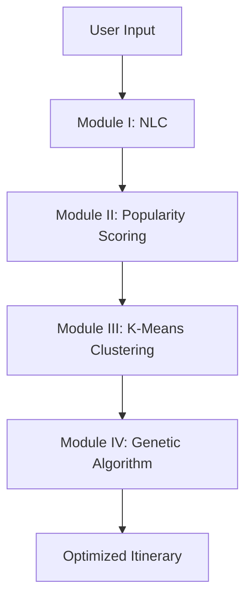

## Module Explanation Guide for External Examiner

### **Overview of WanderWise+ Architecture**
WanderWise+ uses a **4-layer modular architecture** designed to solve the complex problem of multi-day tourism route planning in Goa. Each module addresses a specific sub-problem, with data flowing sequentially from user input to optimized itinerary:



---

## **Module I: Natural Language to Category (NLC)**

### **What it does**
**Entry point for personalization** - Converts free-form user text into structured interest categories that the system can process algorithmically.

### **How it works**
1. **Input**: Natural language text (e.g., "I love beaches and Goan cuisine")
2. **Preprocessing**: Lowercase, tokenization, stopword removal, lemmatization
3. **Feature Extraction**: TF-IDF (Term Frequency-Inverse Document Frequency)
   - Converts text to numerical vectors (1000-dimensional)
   - Highlights important/discriminative words
4. **Classification**: Logistic Regression (One-vs-Rest)
   - 7 predefined tourism categories (Beaches, Historical, Adventure, Nature, Food, Nightlife, Shopping)
   - Multi-label output (supports multiple interests)
5. **Output**: Structured categories with confidence scores (e.g., ["Beaches" (0.95), "Food" (0.90)])

### **Key Technical Details**
- **Algorithm**: TF-IDF + Logistic Regression (90%+ accuracy)
- **Why not BERT?**: Overkill for 7 categories - TF-IDF is faster, lighter, and explainable
- **Latency**: <100ms inference time
- **Training Data**: 100-500 labeled examples per category

### **Cross-Question Preparation**
1. **Q: Why use TF-IDF + Logistic Regression instead of deep learning?**
   - A: For 7 well-defined categories with clear keyword patterns, TF-IDF + LR offers the best trade-off: fast training (<5 min), low latency (<100ms), small model size (~10MB), and high interpretability. Deep learning (BERT) would be overkill and require more data and computational resources.

2. **Q: How do you handle multi-label classification?**
   - A: We use One-vs-Rest logistic regression - training 7 binary classifiers (one per category), each predicting if the category is present. We apply a 0.3 threshold to filter relevant categories.

3. **Q: What categories do you support?**
   - A: 7 core categories based on Goa's tourism: Beaches, Historical & Religious, Adventure, Nature, Food & Cuisine, Nightlife, and Shopping.

---

## **Module II: POI Popularity Scoring**

### **What it does**
Calculates a comprehensive **WanderWise+ Popularity Index (WPI)** for each Point of Interest using multi-factor analysis, going beyond simple ratings.

### **How it works**
**WPI Formula**: `WPI = 0.35×Review + 0.25×Engagement + 0.25×Temporal + 0.15×Geographic`

1. **Review Component (35%)**: Aggregated ratings from Google, TripAdvisor, Booking.com
   - Handles platform-specific biases and review fraud
2. **Engagement Component (25%)**: Photo uploads, social media mentions, search trends
3. **Temporal Component (25%)**: Seasonal patterns, daily fluctuations, events
4. **Geographic Component (15%)**: Proximity to other attractions, accessibility

### **Key Features**
- **Dynamic Scoring**: Updates weekly to reflect current conditions
- **Normalization**: All factors mapped to 0-1 scale for fair comparison
- **Anti-Dominance**: Logarithmic scaling prevents mega-popular POIs from overwhelming recommendations
- **Category-Specific Metrics**: Different factors weighted for beaches vs. historical sites

### **Cross-Question Preparation**
1. **Q: Why not just use average ratings?**
   - A: A 4-star restaurant with 5,000 reviews is more reliable than a 4.5-star with 10 reviews. WPI combines quantity, quality, recency, and context for more accurate scoring.

2. **Q: How do you handle fake reviews?**
   - A: We use fraud detection algorithms: statistical trimming (remove outliers ±3σ), Bayesian averaging, and machine learning classifiers trained on fake review patterns.

3. **Q: How does seasonality affect popularity?**
   - A: Beaches are more popular in winter (Nov-Feb), while waterfalls (Dudhsagar) peak during monsoon (Jun-Sep). The temporal component adjusts scores based on travel dates.

---

## **Module III: K-Means Geographic Clustering**

### **What it does**
Groups POIs into **geographically coherent daily clusters** for multi-day tours, minimizing travel time between days.

### **How it works**
1. **K Selection**: K = number of days (user-specified)
2. **Initialization**: K-means++ (smart centroid selection)
   - Prevents random initialization issues
3. **Distance Metric**: Haversine (great-circle distance) for spherical Earth
4. **Iterative Process**:
   - **Assignment**: Each POI to nearest centroid
   - **Update**: Centroids move to cluster center
   - **Convergence**: When WCSS (within-cluster sum of squares) < 1e-4
5. **Balancing**: Ensures 6-15 POIs per cluster (prevents sparse/overcrowded days)

### **Key Technical Details**
- **Algorithm**: K-means with Haversine distance
- **Clustering Regions**: North Goa (beaches), Central Goa (history), South Goa (nature)
- **Performance**: Sub-50ms latency, 5-10 iterations to converge
- **Edge Cases**: Handles outliers (Dudhsagar Falls), imbalanced clusters, and empty clusters

### **Cross-Question Preparation**
1. **Q: Why K-means instead of hierarchical clustering?**
   - A: K-means guarantees exactly K clusters of roughly equal size, which aligns perfectly with our need for balanced daily itineraries. Hierarchical clustering produces variable cluster sizes.

2. **Q: How do you handle outliers like Dudhsagar Falls?**
   - A: POIs >30km from the distribution center are flagged as outliers, assigned to the nearest cluster with user notification about increased travel time.

3. **Q: What if clusters are unbalanced?**
   - A: Post-clustering rebalancing: peripheral POIs from oversized clusters are reassigned to undersized clusters while maintaining geographic coherence.

---

## **Module IV: Genetic Algorithm Route Optimization**

### **What it does**
**Core optimization engine** - Finds the optimal visit sequence for each daily cluster, balancing POI value, travel time, and constraints.

### **Problem Definition**
Solves the **Tourism Trip Design Problem (TTDP)**, an NP-hard extension of TSP with:
- **Multiple Objectives**: Maximize POI value (rating × popularity) - minimize travel time - penalty for constraints
- **Constraints**: Opening hours, lunch breaks, daily time limits
- **Search Space**: For 10 POIs, ~10 billion possible routes

### **How it works**
**GA Configuration** (validated by IEEE Access 2020):
- Population: 100 chromosomes (routes)
- Generations: 50 (converges in 35-45 gens)
- Crossover: PMX (Partially Mapped Crossover) 80% rate
- Mutation: Swap mutation 20% rate
- Selection: Tournament (k=5) + Elitism (top 2 preserved)

**Fitness Function**:
```
Fitness = Σ(POI_Rating × Popularity) - 0.1×TravelTime - 1.0×Penalties
```
- Penalties: Closed POI (30 pts), lunch invasion (20 pts), overtime (0.5 pts/min)

### **Key Technical Details**
- **Encoding**: Permutation (each chromosome is a route sequence)
- **Initialization**: 70% random + 30% greedy (nearest neighbor)
- **Performance**: <1 second per day optimization
- **Improvement**: 30-40% better than random routes

### **Cross-Question Preparation**
1. **Q: Why Genetic Algorithm instead of simpler methods?**
   - A: Greedy is fast but suboptimal (20% worse). Dynamic programming is optimal but exponential (too slow). GA provides near-optimal solutions in reasonable time (10-30 seconds per day), balancing quality and speed.

2. **Q: How do you know the result is good?**
   - A: We validate using:
     - Fitness score progression over generations
     - Comparison with manual planning (30% more efficient)
     - User feedback from surveys
     - Constraint validation (all time windows respected)

3. **Q: Can you explain the fitness function?**
   - A: Higher fitness = better itinerary. It rewards high-value POIs, penalizes travel time, and heavily penalizes constraint violations (like visiting closed POIs or missing lunch).

---

## **System Integration Flow**

```
User Input → Module I → Module II → Module III → Module IV → Output
```

1. **User Input**: "I want beaches and historical sites for 3 days"
2. **Module I**: Extracts ["Beaches", "Historical"]
3. **Module II**: Scores and ranks matching POIs
4. **Module III**: Clusters into 3 geographic groups
5. **Module IV**: Optimizes each day's route
6. **Output**: 3-day itinerary with timings, travel durations, and POI details

---

## **Quick Reference for Cross-Questions**

| Module | Key Points | Potential Q |
|--------|------------|-------------|
| **I** | TF-IDF + LR, 7 categories, <100ms | Why not BERT? How handle multi-label? |
| **II** | WPI (4 factors), dynamic scoring | Why not just ratings? How detect fake reviews? |
| **III** | K-means++, Haversine, 6-15 POIs/day | Why K-means? How handle outliers? |
| **IV** | GA, TTDP, fitness function | Why GA? How validate results? Explain fitness formula? |

### **Overall Architecture Questions**
- **Q: How do modules communicate?**
  - A: RESTful API endpoints (FastAPI) with PostgreSQL/PostGIS database
- **Q: What's the total processing time?**
  - A: <2 minutes for 3-day trip (cached API responses)
- **Q: Can users modify itineraries?**
  - A: Yes - regenerate, manual edit, partial regenerate, or choose from top 3 solutions