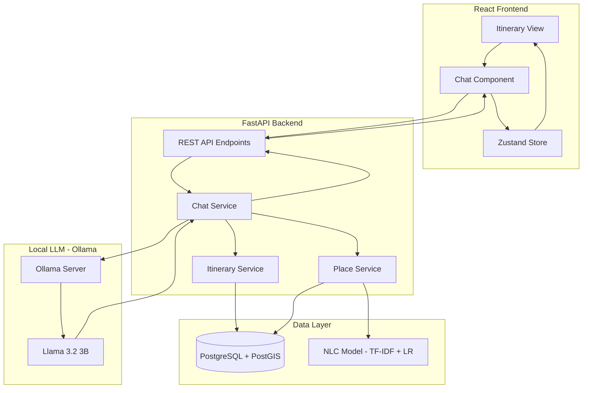
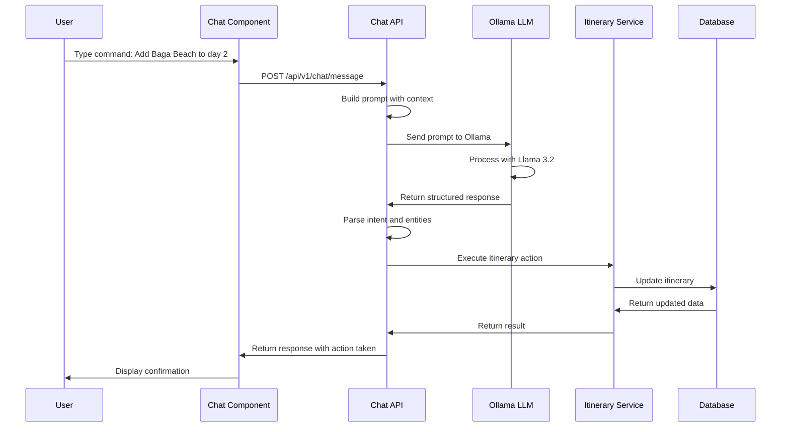

# AI-Powered Chat Interface for Itinerary Management

## Executive Summary

This document outlines the implementation plan for adding an AI-powered chat interface to WanderWise+, enabling users to modify their itineraries through natural language commands. The solution uses **Ollama** with a local LLM (Llama 3.2 3B or Phi-3 Mini) for zero-cost, privacy-preserving AI capabilities.

---

## 1. System Architecture Overview

### 1.1 High-Level Architecture



### 1.2 Data Flow for Chat Commands



---

## 2. Supported Chat Commands

### 2.1 Intent Categories

| Intent | Description | Example Commands |
|--------|-------------|------------------|
| `ADD_PLACE` | Add a new place to itinerary | "Add Baga Beach to my itinerary", "I want to visit Fort Aguada on day 2" |
| `REMOVE_PLACE` | Remove a place from itinerary | "Remove the first place from day 1", "Delete Baga Beach from my trip" |
| `INSERT_PLACE` | Insert place at specific position | "Insert a restaurant after Baga Beach", "Add a temple before the fort visit" |
| `SWAP_PLACES` | Swap two places | "Swap day 1 and day 2", "Exchange the order of Baga and Calangute" |
| `MODIFY_TIME` | Change visit time | "Start day 1 at 9 AM instead of 10 AM", "Spend more time at the beach" |
| `REPLACE_PLACE` | Replace one place with another | "Replace the restaurant with a beach shack" |
| `GET_INFO` | Ask about a place | "Tell me about Dudhsagar Falls", "What is the entry fee for Fort Aguada?" |
| `SUGGEST_PLACES` | Get recommendations | "Suggest some beaches near Calangute", "Recommend a good restaurant for dinner" |
| `OPTIMIZE_ROUTE` | Re-optimize the route | "Optimize my route for less travel time", "Reorder places to minimize distance" |
| `GENERAL_HELP` | Ask for help | "How do I add a place?", "What can you do?" |

### 2.2 Entity Types

| Entity | Description | Examples |
|--------|-------------|----------|
| `place_name` | Name of a place | "Baga Beach", "Fort Aguada", "Dudhsagar Falls" |
| `place_type` | Category of place | "beach", "fort", "restaurant", "temple" |
| `day_number` | Day in itinerary | "day 1", "second day", "tomorrow" |
| `position` | Position in sequence | "first", "last", "after Baga Beach", "before lunch" |
| `time` | Time reference | "9 AM", "morning", "afternoon", "evening" |
| `duration` | Time duration | "2 hours", "half an hour", "more time" |

### 2.3 Response Schema

```json
{
  "intent": "ADD_PLACE",
  "confidence": 0.95,
  "entities": {
    "place_name": "Baga Beach",
    "day_number": 2,
    "position": "end"
  },
  "action_taken": {
    "type": "add_place",
    "place_id": "uuid-here",
    "place_name": "Baga Beach",
    "day": 2,
    "position": 4
  },
  "message": "I've added Baga Beach to your Day 2 itinerary. It's now the 4th stop of the day.",
  "suggestions": [
    "Would you like me to suggest some restaurants near Baga Beach for lunch?",
    "I can also add water sports activities available at Baga Beach."
  ]
}
```

---

## 3. Backend Implementation

### 3.1 New API Endpoints

#### Chat Endpoint
```
POST /api/v1/chat/message
```

**Request Body:**
```json
{
  "message": "Add Baga Beach to day 2",
  "itinerary_id": "uuid-here",
  "conversation_history": [
    {"role": "user", "content": "Previous message"},
    {"role": "assistant", "content": "Previous response"}
  ]
}
```

**Response:**
```json
{
  "response": "I've added Baga Beach to your Day 2 itinerary...",
  "intent": "ADD_PLACE",
  "action_taken": {...},
  "updated_itinerary": {...},
  "suggestions": [...]
}
```

#### Place Search Endpoint (for AI to use)
```
GET /api/v1/places/search?q=baga&category=beaches
```

#### Itinerary Modification Endpoints
```
POST /api/v1/itineraries/{id}/places
DELETE /api/v1/itineraries/{id}/places/{place_id}
PUT /api/v1/itineraries/{id}/places/reorder
```

### 3.2 New Service: ChatService

**File:** `backend/app/services/chat_service.py`

```python
class ChatService:
    def __init__(self, db: Session):
        self.db = db
        self.ollama_url = "http://localhost:11434/api/generate"
        self.model = "llama3.2:3b"
    
    async def process_message(
        self, 
        message: str, 
        itinerary_id: str,
        conversation_history: list
    ) -> ChatResponse:
        # 1. Build context from current itinerary
        context = await self._build_context(itinerary_id)
        
        # 2. Build prompt with system instructions
        prompt = self._build_prompt(message, context, conversation_history)
        
        # 3. Call Ollama API
        llm_response = await self._call_ollama(prompt)
        
        # 4. Parse response and extract intent
        parsed = self._parse_llm_response(llm_response)
        
        # 5. Execute action if applicable
        if parsed.intent in ACTION_HANDLERS:
            result = await ACTION_HANDLERS[parsed.intent](
                self.db, itinerary_id, parsed.entities
            )
        
        # 6. Generate response message
        return self._build_response(parsed, result)
```

### 3.3 Prompt Engineering

**System Prompt Template:**

```
You are an AI assistant for WanderWise+, a travel itinerary planning app for Goa, India.

CURRENT ITINERARY:
{itinerary_context}

AVAILABLE PLACES DATABASE:
{places_context}

USER MESSAGE: {user_message}

You must respond in JSON format:
{
  "intent": "ADD_PLACE|REMOVE_PLACE|INSERT_PLACE|SWAP_PLACES|MODIFY_TIME|REPLACE_PLACE|GET_INFO|SUGGEST_PLACES|OPTIMIZE_ROUTE|GENERAL_HELP|UNKNOWN",
  "entities": {
    "place_name": "extracted place name or null",
    "place_type": "beach|fort|restaurant|temple|waterfall|etc or null",
    "day_number": number or null,
    "position": "first|last|after:X|before:X or null",
    "time": "extracted time or null"
  },
  "reasoning": "brief explanation of your understanding",
  "action_required": true/false,
  "response_message": "friendly response to the user"
}

IMPORTANT RULES:
1. Only use places that exist in the AVAILABLE PLACES DATABASE
2. If a place name is ambiguous, suggest matches
3. Always confirm before making destructive changes
4. Be helpful and suggest alternatives if request cannot be fulfilled
5. For place searches, use fuzzy matching - user might say "Baga" instead of "Baga Beach"
```

---

## 4. Frontend Implementation

### 4.1 New Components

#### ChatPanel Component
**File:** `frontend/src/components/Chat/ChatPanel.jsx`

```jsx
// Floating chat panel that can be opened from any itinerary view
// Features:
// - Chat message history
// - Input field with send button
// - Quick action buttons
// - Typing indicator
// - Action confirmation dialogs
```

#### ChatMessage Component
**File:** `frontend/src/components/Chat/ChatMessage.jsx`

```jsx
// Individual message component
// Supports:
// - User messages (right-aligned)
// - AI messages (left-aligned)
// - Action cards (showing what was changed)
// - Suggestion chips
```

### 4.2 UI Design

```
┌────────────────────────────────────────────────────────────┐
│  Itinerary View                              [💬 Chat AI]  │
├────────────────────────────────────────────────────────────┤
│                                                            │
│  Day 1: North Goa Beaches                                  │
│  ┌─────────────────────────────────────────────────────┐   │
│  │  1. Calangute Beach (9:00 AM - 11:00 AM)            │   │
│  │  2. Baga Beach (11:30 AM - 2:00 PM)                 │   │
│  │  3. Lunch at Britto's (2:00 PM - 3:30 PM)           │   │
│  │  4. Fort Aguada (4:00 PM - 5:30 PM)                 │   │
│  └─────────────────────────────────────────────────────┘   │
│                                                            │
│  ┌─────────────────────────────────────────────────────┐   │
│  │  🤖 WanderWise AI Assistant                   [−][×]│   │
│  ├─────────────────────────────────────────────────────┤   │
│  │                                                     │   │
│  │  🤖 I've added Baga Beach to your Day 2             │   │
│  │     itinerary. It's now the 4th stop.               │   │
│  │                                                     │   │
│  │     ┌───────────────────────────────────────┐       │   │
│  │     │ ✅ Added: Baga Beach                  │      │   │
│  │     │ 📅 Day 2, Position 4                  │      │   │
│  │     │ 🕐 Estimated time: 2 hours            │      │   │
│  │     └───────────────────────────────────────┘      │   │
│  │                                                     │   │
│  │     Suggestions:                                    │   │
│  │     [Add water sports] [Find restaurants nearby]   │   │
│  │                                                     │   │
│  │  👤 Add a good seafood restaurant nearby           │   │a
│  │                                                     │   │
│  ├─────────────────────────────────────────────────────┤   │
│  │  [Add place] [Remove] [Suggest] [Optimize]  [Send] │   │
│  │  ───────────────────────────────────────           │   │
│  │  Type a message...                          [📎] [➤]│   │
│  └─────────────────────────────────────────────────────┘   │
│                                                             │
└─────────────────────────────────────────────────────────────┘
```

### 4.3 State Management Updates

**File:** `frontend/src/stores/chatStore.js`

```javascript
const useChatStore = create((set, get) => ({
  messages: [],
  isOpen: false,
  isLoading: false,
  
  addMessage: (message) => set(state => ({
    messages: [...state.messages, message]
  })),
  
  sendMessage: async (message, itineraryId) => {
    set({ isLoading: true });
    // Call API and handle response
  },
  
  toggleChat: () => set(state => ({ isOpen: !state.isOpen })),
}));
```

---

## 5. Ollama Setup Guide

### 5.1 Installation

```bash
# Linux/macOS
curl -fsSL https://ollama.com/install.sh | sh

# Start Ollama server
ollama serve

# Pull the model (first time only)
ollama pull llama3.2:3b
```

### 5.2 Configuration for WanderWise

**File:** `backend/app/config.py`

```python
class Settings:
    # Ollama Configuration
    OLLAMA_URL: str = "http://localhost:11434"
    OLLAMA_MODEL: str = "llama3.2:3b"
    OLLAMA_TIMEOUT: int = 30  # seconds
    
    # Chat Configuration
    MAX_CONVERSATION_HISTORY: int = 10
    LLM_TEMPERATURE: float = 0.7
    MAX_TOKENS: int = 500
```

### 5.3 Testing Ollama Integration

```bash
# Test API directly
curl http://localhost:11434/api/generate -d '{
  "model": "llama3.2:3b",
  "prompt": "Hello, how are you?",
  "stream": false
}'
```

---

## 6. Implementation Phases

### Phase 1: Backend Foundation
1. Install and configure Ollama
2. Create ChatService with basic Ollama integration
3. Implement prompt templates
4. Create chat API endpoint
5. Add intent parsing logic

### Phase 2: Core Actions
1. Implement ADD_PLACE action
2. Implement REMOVE_PLACE action
3. Implement INSERT_PLACE action
4. Implement SUGGEST_PLACES action
5. Add place search functionality

### Phase 3: Frontend Integration
1. Create ChatPanel component
2. Create ChatMessage component
3. Integrate with itinerary store
4. Add real-time itinerary updates
5. Add typing indicators and loading states

### Phase 4: Advanced Features
1. Add conversation history
2. Implement SWAP_PLACES action
3. Implement MODIFY_TIME action
4. Add OPTIMIZE_ROUTE action
5. Add suggestion chips

### Phase 5: Polish and Testing
1. Add error handling
2. Add input validation
3. Write unit tests
4. Write integration tests
5. Performance optimization

---

## 7. Hardware Requirements

### Minimum Requirements (for Llama 3.2 1B)
- CPU: Any modern processor (2018+)
- RAM: 4GB minimum, 8GB recommended
- Storage: 2GB for model
- No GPU required

### Recommended Requirements (for Llama 3.2 3B)
- CPU: Multi-core processor (4+ cores)
- RAM: 8GB minimum, 16GB recommended
- Storage: 5GB for model
- GPU: Optional, but speeds up inference

### Performance Expectations

| Model | RAM | Response Time | Quality |
|-------|-----|---------------|---------|
| Llama 3.2 1B | 4GB | 0.5-1s | Basic |
| Llama 3.2 3B | 8GB | 1-2s | Good |
| Llama 3.1 8B | 16GB | 2-4s | Excellent |

---

## 8. Alternative: Cloud Deployment

If you need to deploy on a cloud server:

### Option A: CPU-Only VPS
- **Provider**: DigitalOcean, Linode, Hetzner
- **Specs**: 4 vCPU, 8GB RAM
- **Cost**: ~$20-40/month
- **Model**: Llama 3.2 3B

### Option B: GPU Instance
- **Provider**: RunPod, Lambda Labs, AWS
- **Specs**: NVIDIA T4 or better
- **Cost**: ~$0.50-1.00/hour (pay per use)
- **Model**: Llama 3.1 8B or larger

---

## 9. Security Considerations

1. **Input Sanitization**: All user inputs must be sanitized before processing
2. **Rate Limiting**: Limit chat messages per minute to prevent abuse
3. **Action Confirmation**: Destructive actions require explicit confirmation
4. **Error Handling**: Never expose internal errors to users
5. **Logging**: Log all chat interactions for debugging and improvement

---

## 10. Success Metrics

| Metric | Target | Measurement |
|--------|--------|-------------|
| Intent Recognition Accuracy | >90% | Manual testing |
| Response Time | <3 seconds | Automated tests |
| Action Success Rate | >95% | Error logs |
| User Satisfaction | >4/5 | Feedback form |

---

## 11. Next Steps

1. **Review this plan** and confirm the approach
2. **Install Ollama** on your development machine
3. **Switch to Code mode** to begin implementation
4. **Start with Phase 1** (Backend Foundation)

---

## Appendix A: Example Conversations

### Example 1: Adding a Place
```
User: Add Baga Beach to my itinerary
AI: I found Baga Beach in North Goa. Which day would you like to add it to?
    [Day 1] [Day 2] [Day 3]
    
User: Day 2
AI: Great! I've added Baga Beach to Day 2. It's now your 3rd stop of the day.
    Would you like me to suggest some water sports activities there?
```

### Example 2: Removing a Place
```
User: Remove the fort from day 1
AI: I found Fort Aguada on Day 1. Are you sure you want to remove it?
    [Yes, remove it] [No, keep it]
    
User: Yes, remove it
AI: Done! I've removed Fort Aguada from Day 1. Your route has been re-optimized.
    You now have extra time - want to add another place?
```

### Example 3: Getting Suggestions
```
User: Suggest some good restaurants near Calangute
AI: Here are some highly-rated restaurants near Calangute Beach:
    
    1. Britto's (4.2★) - Famous for seafood, right on the beach
    2. Souza Lobo (4.1★) - Goan cuisine, live music
    3. Infantaria (4.0★) - Breakfast and continental
    
    Would you like me to add any of these to your itinerary?
```

---

## Appendix B: File Structure

```
backend/
├── app/
│   ├── api/
│   │   └── routes.py              # Add chat endpoints
│   ├── services/
│   │   ├── chat_service.py        # NEW: Chat processing
│   │   ├── itinerary_service.py   # NEW: Itinerary CRUD
│   │   └── route_planner.py       # Existing
│   ├── schemas/
│   │   └── chat.py                # NEW: Chat schemas
│   └── config.py                  # Add Ollama config

frontend/
├── src/
│   ├── components/
│   │   ├── Chat/
│   │   │   ├── ChatPanel.jsx      # NEW: Main chat panel
│   │   │   ├── ChatMessage.jsx    # NEW: Message component
│   │   │   ├── ChatInput.jsx      # NEW: Input component
│   │   │   └── ActionCard.jsx     # NEW: Action display
│   │   └── Itinerary/
│   │       └── ItineraryView.jsx  # Modify: Add chat button
│   ├── stores/
│   │   └── chatStore.js           # NEW: Chat state
│   └── services/
│       └── chatApi.js             # NEW: Chat API calls
```
