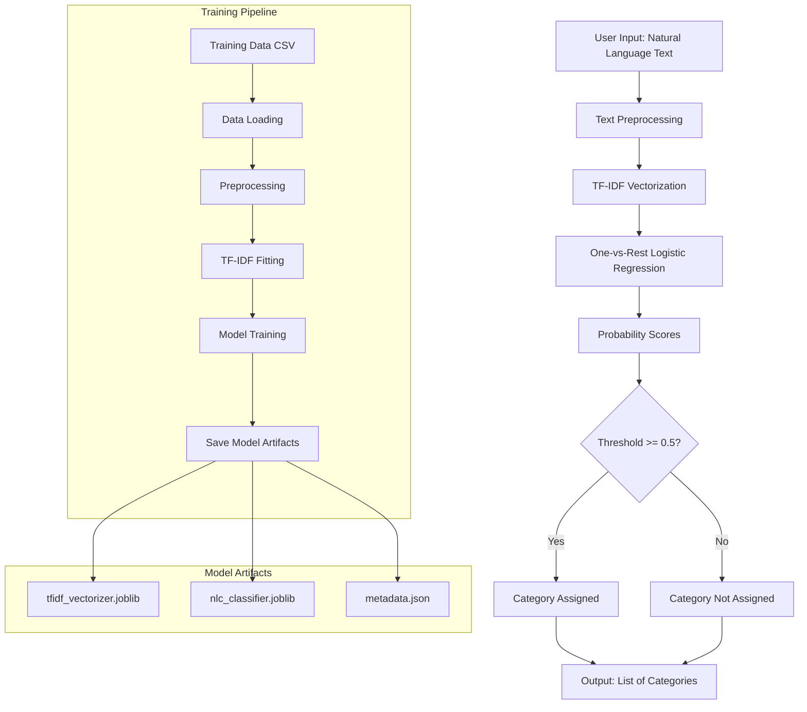

# Module 1: Natural Language to Category (NLC) Model Plan

## Overview

This document outlines the complete plan for building the NLC model that converts user natural language input into structured interest categories for the WanderWise+ tourism application.

## Dataset Summary

- **File**: `nlc_training_data.csv`
- **Total Samples**: 3,149 text entries
- **Features**: 1 text column (`text`)
- **Labels**: 7 binary category columns
  - `beaches` - Coastal areas, water activities
  - `historical` - Forts, churches, temples, monuments
  - `adventure` - Water sports, trekking, extreme activities
  - `nature` - Wildlife, waterfalls, plantations
  - `food` - Restaurants, local cuisine, food tours
  - `nightlife` - Clubs, bars, casinos, parties
  - `shopping` - Markets, handicrafts, souvenirs

## Notebook Structure

The Jupyter notebook will be organized into the following sections:

```
module1.ipynb
├── 1. Setup and Imports
├── 2. Data Loading and Exploration
├── 3. Text Preprocessing
├── 4. TF-IDF Vectorization
├── 5. Model Training
├── 6. Model Evaluation
├── 7. Model Persistence
└── 8. Inference Testing
```

---

## Section 1: Setup and Imports

### Required Libraries

```python
# Data manipulation
import pandas as pd
import numpy as np

# Text processing
import re
import string

# Machine Learning
from sklearn.feature_extraction.text import TfidfVectorizer
from sklearn.model_selection import train_test_split
from sklearn.linear_model import LogisticRegression
from sklearn.multiclass import OneVsRestClassifier
from sklearn.pipeline import Pipeline
from sklearn.metrics import (
    classification_report,
    confusion_matrix,
    f1_score,
    precision_score,
    recall_score,
    accuracy_score,
    hamming_loss
)

# Model persistence
import joblib
import pickle

# Visualization
import matplotlib.pyplot as plt
import seaborn as sns

# Warnings
import warnings
warnings.filterwarnings('ignore')
```

### Configuration Constants

```python
# Random seed for reproducibility
RANDOM_STATE = 42

# TF-IDF parameters
MAX_FEATURES = 1000          # Maximum vocabulary size
MIN_DF = 2                   # Minimum document frequency
MAX_DF = 0.95                # Maximum document frequency (as ratio)
NGRAM_RANGE = (1, 2)         # Unigrams and bigrams

# Train-test split
TEST_SIZE = 0.2              # 20% for testing

# Model parameters
SOLVER = 'liblinear'         # Good for small datasets
C_VALUE = 1.0                # Regularization strength
THRESHOLD = 0.5              # Classification threshold

# File paths
DATA_PATH = '../nlc_training_data.csv'
MODEL_OUTPUT_DIR = '../backend/app/models/nlc/'
```

---

## Section 2: Data Loading and Exploration

### 2.1 Load Dataset

```python
df = pd.read_csv(DATA_PATH)
print(f"Dataset shape: {df.shape}")
```

### 2.2 Basic Statistics

- Total samples count
- Category distribution (count per category)
- Multi-label distribution (how many samples have multiple categories)
- Text length statistics (min, max, mean, median)

### 2.3 Visualizations

1. **Category Distribution Bar Chart**: Shows imbalance between categories
2. **Multi-label Count Distribution**: Shows how many samples have 1, 2, 3+ labels
3. **Text Length Histogram**: Distribution of text lengths

### 2.4 Data Quality Checks

- Check for missing values
- Check for empty strings
- Check for duplicate entries
- Verify label values are binary (0 or 1)

---

## Section 3: Text Preprocessing

### 3.1 Preprocessing Pipeline

```python
def preprocess_text(text):
    """
    Clean and normalize text for TF-IDF vectorization.
    
    Steps:
    1. Convert to lowercase
    2. Remove special characters and punctuation
    3. Remove extra whitespace
    4. Strip leading/trailing whitespace
    """
    # Lowercase
    text = text.lower()
    
    # Remove punctuation
    text = text.translate(str.maketrans('', '', string.punctuation))
    
    # Remove special characters (keep alphanumeric and spaces)
    text = re.sub(r'[^a-z0-9\s]', '', text)
    
    # Remove extra whitespace
    text = re.sub(r'\s+', ' ', text)
    
    # Strip
    text = text.strip()
    
    return text
```

### 3.2 Apply Preprocessing

```python
df['processed_text'] = df['text'].apply(preprocess_text)
```

### 3.3 Before/After Examples

Display sample texts showing original vs processed versions.

---

## Section 4: TF-IDF Vectorization

### 4.1 Configuration Rationale

| Parameter | Value | Rationale |
|-----------|-------|-----------|
| `max_features` | 1000 | Sufficient for 7 categories, prevents overfitting |
| `min_df` | 2 | Ignore terms appearing in only 1 document (typos) |
| `max_df` | 0.95 | Ignore terms in >95% of documents (too common) |
| `ngram_range` | (1, 2) | Capture phrases like "beach party" |
| `stop_words` | 'english' | Remove common words |
| `sublinear_tf` | True | Apply log scaling to term frequencies |

### 4.2 Vectorizer Setup

```python
tfidf_vectorizer = TfidfVectorizer(
    max_features=MAX_FEATURES,
    min_df=MIN_DF,
    max_df=MAX_DF,
    ngram_range=NGRAM_RANGE,
    stop_words='english',
    sublinear_tf=True
)
```

### 4.3 Feature Extraction

```python
X = tfidf_vectorizer.fit_transform(df['processed_text'])
y = df[CATEGORIES].values  # CATEGORIES = list of 7 category names
```

### 4.4 Vocabulary Analysis

- Display top 20 terms by TF-IDF score
- Show sample n-grams captured
- Vocabulary size analysis

---

## Section 5: Model Training

### 5.1 Train-Test Split

```python
X_train, X_test, y_train, y_test = train_test_split(
    X, y, 
    test_size=TEST_SIZE, 
    random_state=RANDOM_STATE
)
```

### 5.2 Multi-Label Classification Strategy

**Approach**: One-vs-Rest (OvR) with Logistic Regression

- Train 7 independent binary classifiers (one per category)
- Each classifier predicts whether the text belongs to its category
- Final output is the union of all positive predictions

### 5.3 Model Pipeline

```python
# Create the classifier
classifier = OneVsRestClassifier(
    LogisticRegression(
        solver=SOLVER,
        C=C_VALUE,
        random_state=RANDOM_STATE,
        max_iter=1000
    )
)

# Train
classifier.fit(X_train, y_train)
```

### 5.4 Training Metrics

- Training time measurement
- Training accuracy
- Number of iterations to converge

---

## Section 6: Model Evaluation

### 6.1 Prediction

```python
y_pred = classifier.predict(X_test)
y_pred_proba = classifier.predict_proba(X_test)
```

### 6.2 Evaluation Metrics

#### Overall Metrics

| Metric | Description | Target |
|--------|-------------|--------|
| **Accuracy** | Exact match ratio | >80% |
| **Hamming Loss** | Fraction of wrong labels | <10% |
| **Macro F1** | Average F1 across categories | >85% |
| **Micro F1** | Global F1 (all predictions) | >85% |

#### Per-Category Metrics

For each of the 7 categories, report:
- Precision: Of predicted positives, how many are correct?
- Recall: Of actual positives, how many were found?
- F1-Score: Harmonic mean of precision and recall
- Support: Number of actual samples in category

### 6.3 Classification Report

```python
print(classification_report(y_test, y_pred, target_names=CATEGORIES))
```

### 6.4 Confusion Matrices

Generate 7 confusion matrices (one per category) showing:
- True Negatives (TN)
- False Positives (FP)
- False Negatives (FN)
- True Positives (TP)

### 6.5 Visualizations

1. **Per-Category F1 Scores**: Bar chart comparing F1 across categories
2. **Confusion Matrix Heatmaps**: 2x2 matrix for each category
3. **ROC Curves**: One curve per category (if using probabilities)

### 6.6 Error Analysis

- Identify misclassified samples
- Analyze patterns in errors
- Categories most often confused with each other

---

## Section 7: Model Persistence

### 7.1 Save Components

Save both the vectorizer and classifier for production use:

```python
import os
os.makedirs(MODEL_OUTPUT_DIR, exist_ok=True)

# Save TF-IDF vectorizer
joblib.dump(
    tfidf_vectorizer, 
    os.path.join(MODEL_OUTPUT_DIR, 'tfidf_vectorizer.joblib')
)

# Save classifier
joblib.dump(
    classifier, 
    os.path.join(MODEL_OUTPUT_DIR, 'nlc_classifier.joblib')
)
```

### 7.2 Alternative: Save as Pipeline

```python
# Create sklearn pipeline
pipeline = Pipeline([
    ('tfidf', tfidf_vectorizer),
    ('classifier', classifier)
])

# Save complete pipeline
joblib.dump(pipeline, os.path.join(MODEL_OUTPUT_DIR, 'nlc_pipeline.joblib'))
```

### 7.3 Model Metadata

Save metadata for versioning:

```python
metadata = {
    'model_version': '1.0.0',
    'training_date': datetime.now().isoformat(),
    'num_samples': len(df),
    'num_features': MAX_FEATURES,
    'categories': CATEGORIES,
    'metrics': {
        'accuracy': accuracy_score(y_test, y_pred),
        'macro_f1': f1_score(y_test, y_pred, average='macro'),
        'micro_f1': f1_score(y_test, y_pred, average='micro')
    }
}

with open(os.path.join(MODEL_OUTPUT_DIR, 'metadata.json'), 'w') as f:
    json.dump(metadata, f, indent=2)
```

---

## Section 8: Inference Testing

### 8.1 Load Model

```python
# Load saved model
loaded_pipeline = joblib.load(os.path.join(MODEL_OUTPUT_DIR, 'nlc_pipeline.joblib'))
```

### 8.2 Prediction Function

```python
def predict_categories(text, pipeline, threshold=0.5):
    """
    Predict interest categories from natural language text.
    
    Args:
        text: User input string
        pipeline: Trained sklearn pipeline
        threshold: Probability threshold for positive prediction
        
    Returns:
        List of predicted category names
    """
    # Preprocess
    processed = preprocess_text(text)
    
    # Get probabilities
    proba = pipeline.predict_proba([processed])[0]
    
    # Apply threshold
    predictions = (proba >= threshold).astype(int)
    
    # Get category names
    predicted_categories = [CATEGORIES[i] for i, pred in enumerate(predictions) if pred == 1]
    
    return predicted_categories, proba
```

### 8.3 Test Cases

Test with various input types:

| Input | Expected Categories |
|-------|---------------------|
| "I love beaches and swimming" | beaches |
| "Want to try Goan fish curry and vindaloo" | food |
| "Looking for nightlife and clubs" | nightlife |
| "Interested in forts and Portuguese churches" | historical |
| "Beaches, food, and some adventure activities" | beaches, food, adventure |
| "Scuba diving and parasailing" | adventure |
| "Wildlife sanctuary and spice plantations" | nature |

### 8.4 Confidence Scores

Display probability scores for each category alongside predictions.

---

## Architecture Diagram



---

## Expected Performance

Based on the research documentation and dataset size:

| Metric | Expected Value |
|--------|----------------|
| Training Time | < 5 minutes |
| Inference Time | < 50ms per request |
| Model Size | ~10MB |
| Accuracy | 88-92% |
| Macro F1 | 85-90% |
| Per-Category F1 | 80-95% |

---

## Integration with Backend

### API Endpoint Structure

```python
# backend/app/api/routes.py

@router.post("/classify-interests")
async def classify_interests(request: InterestRequest):
    """
    Classify user interests from natural language.
    
    Request body:
    {
        "text": "I want beaches and local food"
    }
    
    Response:
    {
        "categories": ["beaches", "food"],
        "confidence_scores": {
            "beaches": 0.92,
            "food": 0.87,
            "historical": 0.12,
            ...
        }
    }
    """
```

### Service Layer

```python
# backend/app/services/nlc_service.py

class NLCService:
    def __init__(self):
        self.pipeline = joblib.load('models/nlc/nlc_pipeline.joblib')
        self.categories = ['beaches', 'historical', 'adventure', 
                          'nature', 'food', 'nightlife', 'shopping']
    
    def predict(self, text: str) -> tuple[list[str], dict[str, float]]:
        # Implementation
        pass
```

---

## Next Steps

1. **Implement the notebook** following this plan
2. **Evaluate results** and adjust hyperparameters if needed
3. **Create backend service** for model inference
4. **Add API endpoint** for frontend integration
5. **Write unit tests** for the NLC module
6. **Document model performance** in production

---

## Files to Create

| File | Purpose |
|------|---------|
| `module1.ipynb` | Main Jupyter notebook with complete pipeline |
| `backend/app/services/nlc_service.py` | Service class for model inference |
| `backend/app/models/nlc/` | Directory for saved model artifacts |
| `backend/app/schemas/nlc.py` | Pydantic schemas for API request/response |

---

## References

- [Module I - NLC Fundamentals](../ModuleResearch/Module_I_NLC/01_nlc_fundamentals.md)
- [Training Data Template](../ModuleResearch/Module_I_NLC/02_training_data_template.md)
- [TF-IDF Implementation](../ModuleResearch/Module_I_NLC/03_tfidf_implementation.md)
- [Classification Evaluation](../ModuleResearch/Module_I_NLC/04_classification_evaluation.md)
